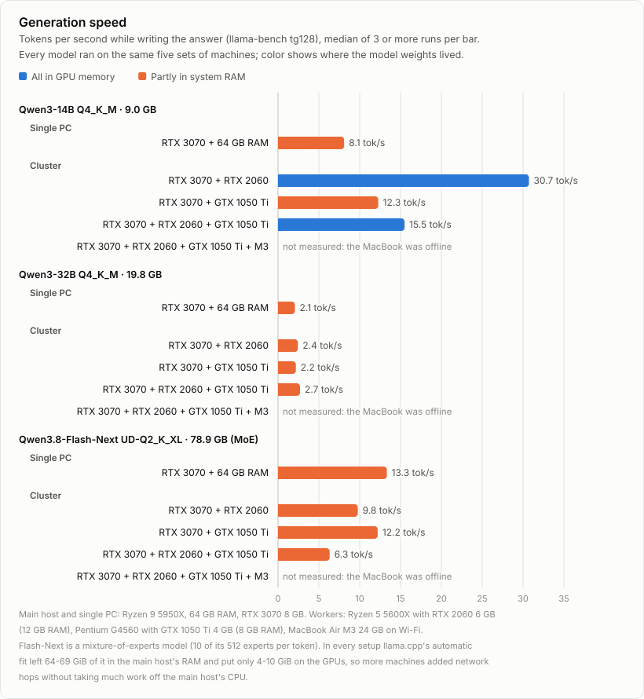
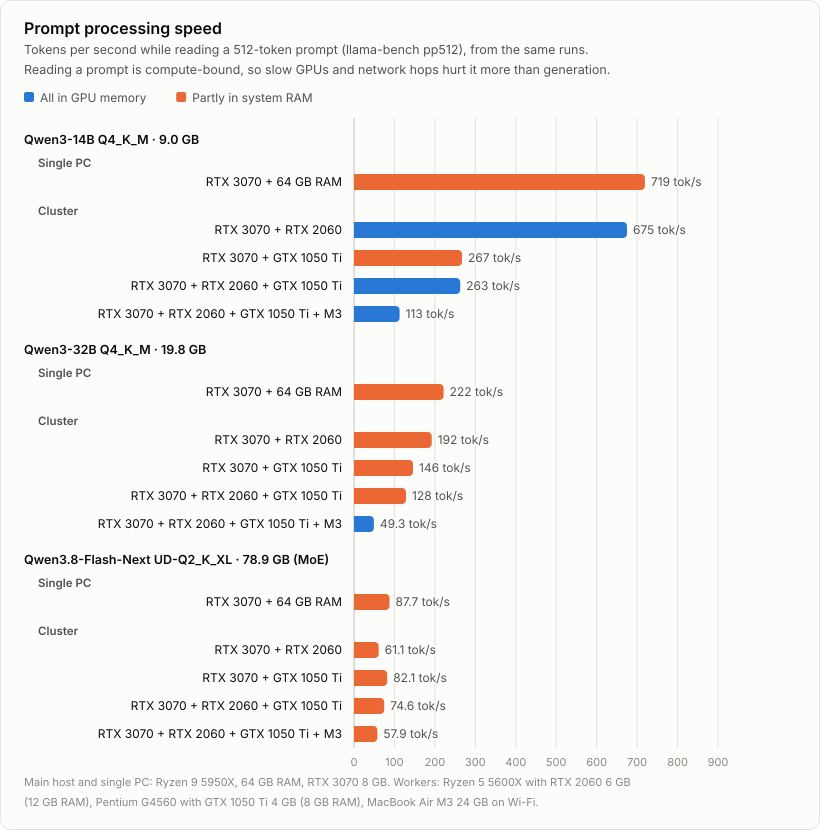
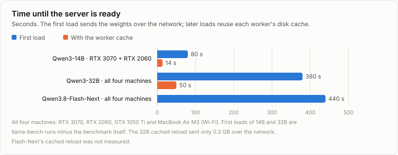
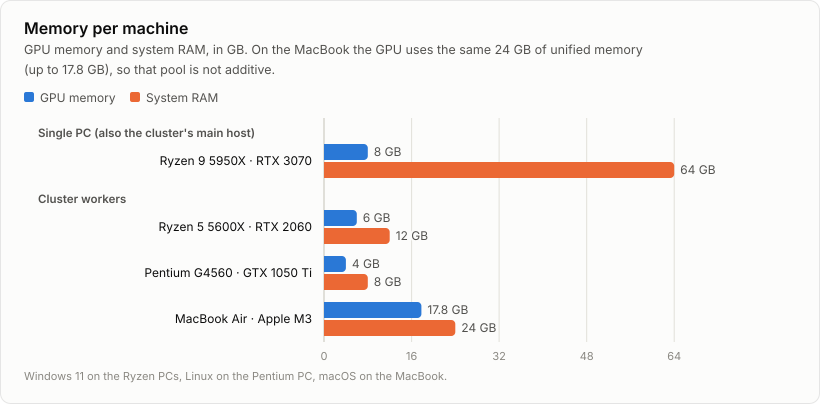
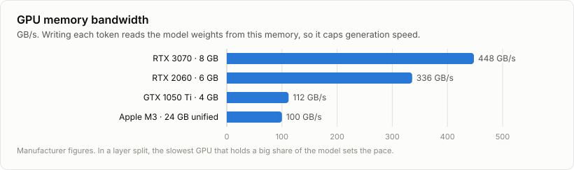
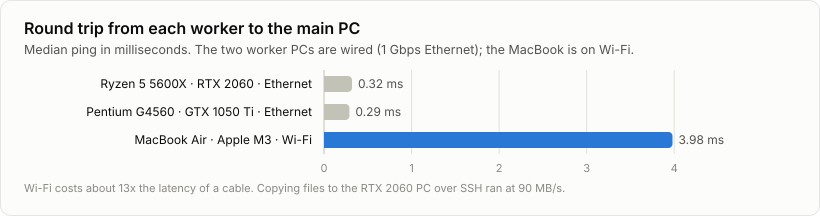

# FastLLM

Run **one** llama.cpp model split across several computers and serve it through an OpenAI-compatible endpoint. Each worker lends its GPU; the main host combines them and serves the model. The main host and the workers can run Windows, Linux or macOS, in any mix.

## How it works

- Every worker runs `ggml-rpc-server` bound to `127.0.0.1`.
- The main host opens an SSH tunnel to each worker and uses the remote GPUs as if they were local (`--rpc`).
- The model is split **by layers**: GPU memory adds up, and each token passes through every machine, one after the other.
- `llama-server` on the main host exposes the API (`/v1/chat/completions`, `/v1/completions`, `/v1/models`, `/v1/embeddings`) and a web chat.

## Requirements

| Machine | Needs |
|---|---|
| Main host | Python 3.8+, OpenSSH client (`ssh`, `scp`), access to GitHub |
| Windows worker | Windows 10/11, an administrator account during setup |
| Linux worker | x64 or arm64, `sudo` during setup, systemd |
| macOS worker | Apple Silicon, Remote Login enabled |
| Network | Wired. Wi-Fi hurts performance |

NVIDIA GPUs need the driver installed (`nvidia-smi` working); the CUDA Toolkit is not required. AMD Radeon RX/Pro and Intel Arc GPUs run through Vulkan. A machine without a supported GPU joins as CPU and usually slows the whole cluster down.

### Linux

- The prebuilt llama.cpp CUDA package needs glibc 2.39+ (Ubuntu 24.04, Debian 13, Fedora 40 or newer). On older systems, such as Ubuntu 22.04, the tool switches NVIDIA GPUs to the Vulkan package, which runs on glibc 2.35+. The setup script installs the Vulkan loader (`libvulkan1`).
- RHEL/Rocky/Alma 9 (glibc 2.34) cannot run the prebuilt packages; build llama.cpp from source there.
- Workers must not suspend. On GNOME: Settings → Power → Automatic Suspend off. On dedicated machines: `sudo systemctl mask sleep.target suspend.target hibernate.target hybrid-sleep.target`.
- Behind a proxy, run `export HTTPS_PROXY=http://proxy:port` before `install` and `pull`.
- Gated models on Hugging Face (Llama and others) need `export HF_TOKEN=...` before `pull`.

### Tested combinations

| Main host | Workers |
|---|---|
| Windows 11 | Windows 11 (RTX 2060), Linux x64 (GTX 1050 Ti), macOS on Apple Silicon (M3) |
| Linux (Ubuntu 24.04) | Linux x64 (GTX 1050 Ti) |

## Quick start (Linux main host)

1. Clone the repo on the main host and run the setup script:
   ```
   git clone https://github.com/Raphalsk050/FastLLM.git
   cd FastLLM
   ./setup-main.sh
   ```
   It checks the required tools, creates `cluster.json`, `models.ini` and an SSH key used only by the cluster, and installs llama.cpp on this machine. If the detected IP is wrong (VPN, several networks), run `./setup-main.sh --main-ip IP`.
2. Register the workers, in one of two ways:
   - **At each worker:** run `python3 cluster.py enroll` on the main host. It prints one command; paste it into a terminal on each worker. The command downloads the setup script from the main host, checks its sha256, runs it with `sudo` and registers the worker. Press Ctrl+C on the main host once every worker shows up.
   - **From the main host:** if the workers already accept SSH with a password, run `python3 cluster.py bootstrap user@10.0.0.11 user@10.0.0.12 ...` and type each password when asked.

   Windows workers: run `generated/worker-setup-windows.ps1` as administrator (`powershell -ExecutionPolicy Bypass -File worker-setup-windows.ps1`), then the `add` line it prints.
3. Install llama.cpp on the workers and start them:
   ```
   python3 cluster.py install
   python3 cluster.py start
   ```
   `start` prints each worker's free GPU memory. Add it up to pick a model: the file size plus ~15% for the context has to fit.
4. Download a model and create its profile:
   ```
   python3 cluster.py pull Qwen/Qwen3-32B-GGUF Qwen3-32B-Q4_K_M.gguf --profile qwen32b
   ```
5. Serve it:
   ```
   python3 cluster.py serve qwen32b --detach --public
   ```
   The command prints the URL, the API key and the model name.
6. When you are done:
   ```
   python3 cluster.py stop
   ```

On a Windows main host, use `python` instead of `python3`, and run `python cluster.py init` followed by `python cluster.py install` instead of `setup-main.sh`.

## Model profiles (`models.ini`)

Each `[section]` is a profile with the same settings LM Studio exposes. A commented or missing line keeps the llama.cpp default. Settings under `[DEFAULT]` apply to every profile.

```ini
[qwen14b]
model = /models/Qwen3-14B-Q4_K_M.gguf
context_length = 8192
temperature = 0.7
top_k = 20
top_p = 0.8
min_p = 0.0
thinking = off
```

| Key | LM Studio setting | Values |
|---|---|---|
| `model` / `hf` | Model | path to a `.gguf` file / Hugging Face `user/repo:quant` |
| `alias` | — | model name API clients see (default: the profile name) |
| `context_length` | Context Length | tokens |
| `gpu_offload` | GPU Offload | `auto`, `all` or a number of layers |
| `flash_attention` | Flash Attention | `on`, `off`, `auto` |
| `k_cache_type` / `v_cache_type` | K/V Cache Quantization Type | `f16`, `q8_0`, `q4_0`... |
| `offload_kv_cache` | Offload KV Cache to GPU Memory | `true` / `false` |
| `use_mmap` / `keep_in_memory` | Try mmap() / Keep Model in Memory | `true` / `false` |
| `cpu_threads` | CPU Thread Pool Size | number |
| `batch_size` / `ubatch_size` | Evaluation Batch Size | number |
| `moe_cpu_layers` | Force Model Expert Weights onto CPU | number of MoE layers kept on the CPU |
| `rope_freq_base` / `rope_freq_scale` | RoPE Frequency Base / Scale | number |
| `seed` | Seed | `-1` = random |
| `parallel` | — | requests served at the same time |
| `temperature`, `top_k`, `top_p`, `min_p` | Sampling | number |
| `repeat_penalty`, `repeat_last_n`, `presence_penalty`, `frequency_penalty` | Repeat Penalty and related | number |
| `max_tokens` | Limit Response Length | `-1` = no limit |
| `thinking` | Enable Thinking | `on`, `off`, `auto` |
| `chat_template_file` | Prompt Template | Jinja file |
| `extra` | — | any other `llama-server` argument |

Generation settings become the server defaults; every API request can still send its own (`temperature`, `top_p`, `max_tokens`, `top_k`, `min_p`...). The system prompt goes in the request itself (a `system` message) or in the web chat settings.

## Connecting to the endpoint

`serve --public` accepts connections from the network and requires an API key. The key is generated on first use and stored in `cluster.json`, so it survives restarts. `python cluster.py endpoint` prints the URL, key and model again.

```python
from openai import OpenAI

client = OpenAI(base_url="http://MAIN_HOST_IP:8080/v1", api_key="YOUR_KEY")
r = client.chat.completions.create(
    model="qwen14b",
    messages=[{"role": "user", "content": "hello"}],
    temperature=0.7,
)
print(r.choices[0].message.content)
```

Any app that accepts an OpenAI-compatible server (Open WebUI, editor extensions, LangChain and so on) uses the same base URL and key.

For other machines to connect, the port must be open in the main host's firewall. `serve --public` prints the exact command for your system.

## Commands

| Command | What it does |
|---|---|
| `init [--key FILE] [--main-ip IP]` | Creates the config, profiles, SSH key and worker scripts |
| `enroll [--port P]` | Serves the Unix setup script and prints the one-line command that prepares and registers each worker |
| `bootstrap USER@IP...` | Prepares and registers Linux/macOS workers that already accept SSH with a password |
| `add IP USER [--name N] [--backend cuda\|vulkan\|cpu\|metal]` | Registers a worker that is already prepared, detecting its OS and GPU |
| `remove NAME` | Removes a worker |
| `status` | Shows the server and, per worker, install state, RPC server and tunnel |
| `install [--force]` | Downloads llama.cpp (sha256 checked) and installs it here and on the workers |
| `start [--skip N1,N2]` | Starts the RPC servers and tunnels, and prints each worker's free memory; `--skip` leaves workers out without removing them |
| `models` | Lists the profiles in `models.ini` |
| `pull REPO FILE [--profile N] [--dir D] [--context C]` | Downloads a GGUF from Hugging Face (resumable, sha256 checked, split files included) and creates its profile |
| `bench PROFILE\|FILE [--quick] [--local]` | Measures speed; `--local` uses only the main host, for comparison |
| `serve PROFILE\|FILE [--detach] [--public] [--port P] [--api-key K] [--local]` | Serves the API with every GPU |
| `endpoint` | Prints the URL, key and model of the running server |
| `stop` | Stops the server, the tunnels and the RPC servers |
| `clean` | Deletes the weight cache on the workers |

Arguments after `--` go straight to llama.cpp, e.g. `python cluster.py serve qwen14b -- --cache-reuse 256`.

## Configuration (`cluster.json`)

| Field | Default | Purpose |
|---|---|---|
| `build` | `b11115` | llama.cpp build. Every machine must run the same one |
| `vram_margin_main_mib` | `1536` | Free memory kept on each main host GPU (the desktop and other apps use it too) |
| `vram_margin_mib` | `1024` | Free memory kept on each worker GPU |
| `server_port` | `8080` | API port |
| `api_key` | generated | API key for `--public` |
| `rpc_cache` | `true` | Workers keep the weights on disk, so reloads are fast |
| `base_port` / `remote_port` | `50052` | Tunnel ports |
| `local_backend` | `auto` | Forces `cuda`, `vulkan`, `cpu` or `metal` on the main host |

## Security

- The RPC port has no authentication, so it is never exposed on the network: it only exists inside the SSH tunnel.
- Workers accept SSH only with the main host's key. On Windows the firewall only accepts the main host's IP; on Linux, too, when `ufw` or `firewalld` is active.
- `serve --public` requires an API key. Without `--public`, only the main host can connect.
- On a company network, clear it with IT first: the setup installs an SSH server and uses the GPUs of other people's machines.
- On Windows, Microsoft Entra ID accounts cannot log in with an SSH key. Set up the worker with a local administrator account.

## What to expect

- **More machines means more memory, not more speed.** With the model split by layers, generation time is roughly the sum of every machine's share. It pays off when the model would not fit on fewer GPUs: Qwen3-32B went from 1.9 tokens/s on one PC to 4.7 tokens/s on four machines.
- **Leave slow machines out when you can.** Qwen3-14B ran at 26.7 tokens/s on two PCs and at 7.1 tokens/s after adding a GTX 1050 Ti and a MacBook Air on Wi-Fi.
- **Prompts suffer first.** Reading a prompt is compute-bound, so slow GPUs and Wi-Fi hurt it more than generation; the server's prompt cache makes repeated prefixes almost free.
- **First load:** the main host sends the weights to every worker (~90 MB/s on 1 Gbps, so 100 GB takes ~20 minutes). Later loads use each worker's cache (Qwen3-32B went from ~380 s to 50 s).
- **Full GPU:** on Windows, when a GPU fills up the system moves part of the model to RAM and generation drops below 1 token/s (`nvidia-smi dmon` shows ~10 GB/s of PCIe traffic). Raise the margins in `cluster.json` or lower `context_length`.

See [Benchmarks](#benchmarks) for every measurement.

## Benchmarks

Measured on a small home cluster with llama.cpp b11115. The machine with the RTX 3070 is the main host in every cluster run and also the single-PC baseline.

| Role | CPU | RAM | GPU | GPU memory | Link to the main host |
|---|---|---|---|---|---|
| Main host / single PC | AMD Ryzen 9 5950X | 64 GB | NVIDIA RTX 3070 | 8 GB | — |
| Worker | AMD Ryzen 5 5600X | 12 GB | NVIDIA RTX 2060 | 6 GB | 1 Gbps Ethernet |
| Worker | Intel Pentium G4560 | 8 GB | NVIDIA GTX 1050 Ti | 4 GB | 1 Gbps Ethernet |
| Worker | Apple M3 (MacBook Air) | 24 GB unified | Apple M3 GPU | up to 17.8 GB | Wi-Fi |

<picture>
  <source media="(prefers-color-scheme: dark)" srcset="docs/charts/generation-speed-dark.svg">
  
</picture>

<picture>
  <source media="(prefers-color-scheme: dark)" srcset="docs/charts/prompt-speed-dark.svg">
  
</picture>

<picture>
  <source media="(prefers-color-scheme: dark)" srcset="docs/charts/load-time-dark.svg">
  
</picture>

<picture>
  <source media="(prefers-color-scheme: dark)" srcset="docs/charts/hardware-memory-dark.svg">
  
</picture>

<picture>
  <source media="(prefers-color-scheme: dark)" srcset="docs/charts/hardware-bandwidth-dark.svg">
  
</picture>

<picture>
  <source media="(prefers-color-scheme: dark)" srcset="docs/charts/network-latency-dark.svg">
  
</picture>

### All measurements

| Model | Setup | Where the weights lived | Prompt (tok/s) | Generation (tok/s) | Source |
|---|---|---|---|---|---|
| Qwen3-14B Q4_K_M (9.0 GB) | Single PC: RTX 3070 + 64 GB RAM | partly in RAM | 640 | 7.9 | llama-bench |
| Qwen3-14B Q4_K_M | Cluster: RTX 3070 + RTX 2060 | GPU | 672 | 26.7 | llama-bench |
| Qwen3-14B Q4_K_M | Cluster: RTX 3070 + RTX 2060, 8k context | GPU | — | 20.5 | server |
| Qwen3-14B Q4_K_M | Cluster: RTX 3070 + RTX 2060, 8k context, 1 GB VRAM margin | VRAM spilled to RAM | — | 0.5 | server |
| Qwen3-14B Q4_K_M | Cluster: RTX 3070 + GTX 1050 Ti | partly in RAM | 219 | 10.5 | llama-bench |
| Qwen3-14B Q4_K_M | Cluster: RTX 3070 + RTX 2060 + GTX 1050 Ti + M3 | GPU | 100 | 7.1 | llama-bench |
| Qwen3-32B Q4_K_M (19.8 GB) | Single PC: RTX 3070 + 64 GB RAM | partly in RAM | 210 | 1.9 | llama-bench |
| Qwen3-32B Q4_K_M | Cluster: RTX 3070 + RTX 2060 + GTX 1050 Ti | partly in RAM | 112 ¹ | 2.2 | server |
| Qwen3-32B Q4_K_M | Cluster: RTX 3070 + RTX 2060 + GTX 1050 Ti + M3 | GPU | 53 | 4.7 | llama-bench |
| Qwen3-32B Q4_K_M | Cluster: same four machines | GPU | 48 ¹ | 4.9 | server |
| Qwen3.8-Flash-Next UD-Q2_K_XL (78.9 GB, MoE, 6B active) | Cluster: RTX 3070 + RTX 2060 + GTX 1050 Ti + M3 | partly in RAM (~42 GB) | 0.5 cold, 10.9 warm ² | 3.5 | server |

¹ 2,500-token prompt. ² short prompt. llama-bench used pp512 for prompts and tg128 or tg32 for generation. Server runs used 16k context unless the setup says otherwise; the server returned a repeated system prompt from its cache in 0.6-0.9 s.

| Load and network | Result |
|---|---|
| Qwen3-14B, RTX 3070 + RTX 2060: first load / reload with the worker cache | ~80 s / 14 s |
| Qwen3-32B, four machines: first load / reload with the worker cache | ~380 s / 50 s (0.3 GB sent) |
| Qwen3.8-Flash-Next, four machines: first load | 440 s |
| Median ping to the wired workers | 0.29-0.32 ms |
| Median ping to the MacBook on Wi-Fi | 3.98 ms |
| File copy to a wired worker over SSH | 90 MB/s |

The charts come from `docs/charts/make_charts.py` (no dependencies); after changing its numbers, run `python docs/charts/make_charts.py`.

## Files

- `cluster.py`: the tool (runs on the main host).
- `setup-main.sh`: first-time setup of a Linux or macOS main host.
- `worker-setup-windows.ps1`, `worker-setup-unix.sh`: templates for the worker setup scripts; `init` writes filled-in copies to `generated/`.
- `docs/charts/`: benchmark charts (light and dark SVGs) and the script that draws them.
- `~/.llama-cluster/` on the main host: downloads, binaries, logs (tunnels and `server.log`) and state.
- `~/llama-cluster/` on the workers: binaries.
